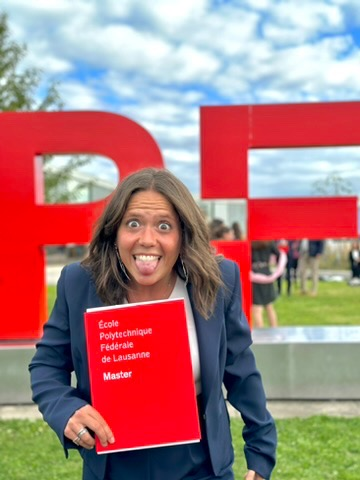

# **Git-in-Touch** 👋

Welcome to **Git-in-Touch**, an interactive repository to explore my journey as a **Mathematical Engineer** specializing in Machine Learning and its applications in biomedicine.

---

## **🧑‍💻 About Me**
Hi, I'm **Francesca Venturi**, a mathematical engineer passionate about using Machine Learning to solve real-world problems, especially in the biomedical field. I'm constantly seeking challenges that combine critical thinking and innovative technology.

- 🌍 **Based in:** Lausanne, Switzerland  
- 🎓 **Education:** Double MSc in Computational Science and Engineering (EPFL + Politecnico di Milano)  
- 🧠 **Interests:** Biomedical Machine Learning, Lipidomics, and Synthetic Data Generation  

---

## **🎓 Educational Background**

 

- **Born and Raised:** Bologna, Italy, where I attended an *Enhanced Scientific High School with an International Focus* (Liceo Ginnasio Luigi Galvani, Bologna).
- **High School Graduation:** Maturità with a score of **100/100**, earning **7 IGCSE certifications** in *English, French, Maths, Physics, Geography, Biology, and Photography*. 

### **Bachelor’s Degree (2018-2021)**
- **University:** Politecnico di Milano, Italy  
- **Program:** [Mathematical Engineering](https://www.polimi.it/formazione/corsi-di-laurea/dettaglio-corso/ingegneria-matematica)  
- **Achievements:**  
  - Scholarship for best freshmen after the first year.  
  - Graduated in **3 years with a score of 110/110 cum laude**.  

### **Master’s Degree (2021-2024)**
- **Dual Degree Path:**  
  - **Politecnico di Milano:** [Computational Science and Computational Learning](https://www.mate.polimi.it/im/?p=10#div1)  
  - **EPFL, Lausanne:** [Computational Science and Engineering](https://www.epfl.ch/education/master/programs/computational-science-and-engineering/)  
  - Graduated at PoliMi with 110/110 cum laude (October 2024), and thesis score **6/6** at EPFL.

- **Timeline:**  
  - *First Year:* Courses at Politecnico di Milano.  
  - *Second Year:* Courses at EPFL.  
  - *Third Year:* Internship at [AXA - GO](https://careers.axa.com/global/en/axa-group-operations) on Synthetic Data Generation for Healthcare, collaborating with [Healthanea](https://www.healthanea.com/) (AXA & Microsoft spinoff) and Master's Thesis conducted in the [Brain Development and Biological Data Science Lab](https://www.epfl.ch/labs/nsbl/) at EPFL, supervised by Professor Gioele LaManno.   

After a well-deserved month-and-a-half break, I began a **research fellowship** in the same EPFL lab to continue studying the role of lipids in the brain. 

 
  
 

---

## **📁 Repository Overview**
Explore the sections below to learn more:

- 📜 **[CV](./CV_FrancescaVenturi_monocol.pdf):** A comprehensive overview of my academic and professional background.  
- 💡 **[Projects](./projects/):** Dive into my work, from VAE models for lipid metabolism to protein reconstruction and privacy-preserving techniques.  
- 🏀 **[Personal Interests](./personal/):** Discover my journey as a basketball player, sports enthusiast, and volunteer.  

---

## **📫 How to Reach Me**
- **GitHub:** [@francescaventurigit](https://github.com/francescaventurigit)  
- **Email:** [francesca.venturi@epfl.ch](mailto:francesca.venturi@epfl.ch)  
- **LinkedIn:** [Francesca Venturi](https://www.linkedin.com/in/francesca-venturi)  

---

🌟 _Feel free to explore and connect!_