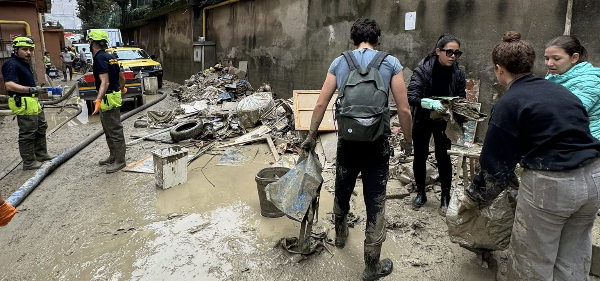

# The Human behind the Engineer 🌟

Hi there! I'm Francesca, a curious soul constantly exploring the world, both literally and figuratively. This part of the repository dives into who I am outside the technical world. Spoiler alert: I love sports, traveling, staying informed, and giving back to the community!

---

## 🏀 My Love for Sports 
I grew up in a family of sports enthusiasts, and it’s safe to say that sports are part of my DNA. What excites me most about sports is the perfect mix of competition, solidarity, and the purest form of meritocracy.  

- **Skiing**: My one true love. Despite growing up far from the mountains in Bologna, I’ve always been drawn to the adrenaline, the fresh air, and the thrill of skiing—whether it’s solo or with friends.  
- **Basketball**: I played competitively for years, and later on, I transitioned into coaching—a deeply rewarding experience that taught me the value of teamwork and leadership.  
- **Tennis**: As a spectator, nothing beats tennis for me. It’s pure mental strength on display, and I can’t get enough of it!  

---

## ✈️ Wanderlust Adventures  
I'm endlessly fascinated by how new places can shape our perceptions and emotions. Traveling isn't just about seeing beautiful sights (though those are a bonus!); it's about the feelings and instincts that arise when you're immersed in different environments.  
Here are a few snapshots of places that truly left a mark on me. 🌍📸  

---

## 🎙️ Staying in the Loop  

Curiosity drives me, and podcasts are one of my favorite ways to keep learning and exploring different perspectives. Whether it’s history, geopolitics, or daily news, I love tuning in to hear experts and storytellers share their insights. Here are some of my go-to listens:  

- **History Buff?** While I usually avoid recommending something in Italian for an international audience, I can't resist mentioning *Il podcast di Alessandro Barbero*. It's a true cultural phenomenon in Italy, and surprisingly so, considering it’s all about history!  
- **Geopolitics?** *The Ezra Klein Show* dives deep into ideas shaping politics, culture, and the world. Thought-provoking and packed with amazing guests.  
- **News?** For Italian current affairs, I follow *Morning by Il Post*, a concise and engaging roundup of the latest news. For international coverage, I turn to *The Daily by The New York Times*, which offers top-notch storytelling and analysis.  

Have any podcast recommendations? Let me know—I’m always looking for the next great listen! 🎧

---

## 💙 Volunteering  
Recently, I had the opportunity to volunteer in flood-affected areas of my hometown, Bologna. It was a truly humbling and enriching experience—collaboration and solidarity are powerful forces. Moving forward, I plan to dedicate as much time as I can to volunteering. It’s a way of giving back that makes me feel genuinely useful.  

---

## 🎵 & 📚 Currently Loving  
I like to keep this part updated with what’s inspiring me these days—whether it's a song I can't stop playing or a book I just finished. Here's what's currently on my list:  
- **Song:** [*Empress*](https://www.youtube.com/watch?v=4aRseR4SjUM&ab_channel=Morningsiders)  by the Morningsiders🎶  
- **Book:** [*The Mountains Sing*](https://en.wikipedia.org/wiki/Nguy%E1%BB%85n_Phan_Qu%E1%BA%BF_Mai) by the Vietnamese writer Nguyễn Phan Quế Mai📖  

---

Thanks for stopping by! Feel free to explore the photos or suggest your favorite song, book, podcast, or even a great ski destination—I'm all ears! 😊
