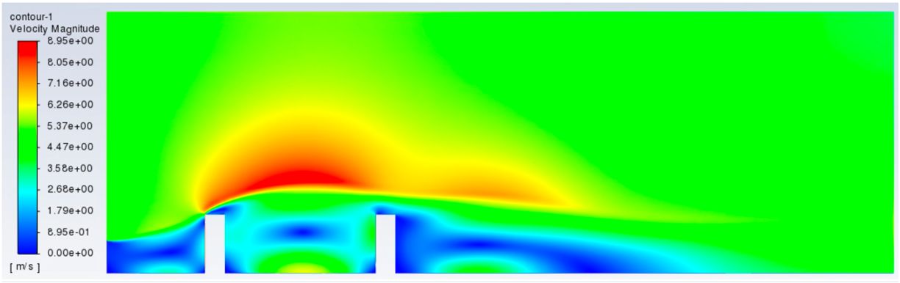

# My Projects 📂  

This repository showcases the diverse projects I've worked on during my academic and professional journey. Each project includes a brief description and a link to a detailed report and/or presentation.

---

## 🧬 1. LipiMap: A Biologically-Informed VAE for Lipid Metabolism (Master Thesis)
- **Description:** Developed a Variational AutoEncoder (VAE) to analyze lipidomic data, mapping lipid expressions into biologically meaningful lipid programs.
- **Highlights:**
  - Integrated prior biological knowledge for model interpretability.
  - Conducted extensive evaluation on lipidomic datasets.
- [Report](../content/lipimap_report.pdf) | [Presentation](../content/lipimap_presentation.pdf) | Code (PRIVATE, soon available [here](https://github.com/lamanno-epfl))

---

## 🧩 2. Deep Learning Models for Protein Assembly
- **Description:** Designed a Denoising AutoEncoder to reconstruct protein structures, reducing dimensionality for data interpretability.  
- [Presentation](../content/protein_assembly_presentation.pdf) |  Code (PRIVATE, the reference model for geometric transformers is [PeSTo](https://www.nature.com/articles/))

---

## 🧠 3. Mathematical Modeling of Neurodegenerative Disorders
- **Description:** Built a graph approximation of the cerebral network and solved non-linear PDEs to simulate neurodegenerative diseases.  
- [Report](../content/neurodegenerative_modelling_report.pdf) | [Presentation](../content/neurodegenerative_modelling_presentation.pdf)

---

## 🩺 4. Parameter Estimation in PDE-Regularized Spatial Regression
- **Description:** Optimized penalization parameters in physics-informed models for blood flow simulation in cardiovascular research.  
- [Presentation](../content/pde_regularization_presentation.pdf)

---

## 🤖 5. Deep Q-Learning for Epidemic Mitigation
- **Description:** Developed and compared various Deep Q-Learning approaches for optimal epidemic control strategies.  
- **Highlights:**  
  - Developed DQN agents with binary and complex action spaces  
  - Analyzed effectiveness of toggle-action-space and factorized Q-values approaches  
- [Report](../content/reinforcement_learning_report.pdf) | [Code](https://github.com/francescaventurigit/DQN_Project)

---

## 📉 6. Sharpness-Aware Minimization for Generalization
- **Description:** Investigated optimization techniques to improve neural network generalization by accounting for the loss function's landscape.  
- [Presentation](../content/sharpness_aware_report.pdf) | [Code](https://github.com/francescaventurigit/sharpness-aware_minimization)

---

## 🔍 7. Gaussian Process Regression for Geoscience Applications
- **Description:** Applied Gaussian Process Regression to predict subsurface permeability fields using limited borehole data.  
- **Highlights:**  
  - Explored the use of different covariance kernels (Exponential and Squared Exponential).  
  - Implemented Bayesian optimization for hyperparameter tuning.  
- [Report](../content/gaussian_process_regression_report.pdf) | [Presentation](../content/gaussian_process_regression_presentation.pdf) | [Code](https://github.com/francescaventurigit/Gaussian-Process-Regression)

---

## 🌍 8. Studying the Impact of Urban Design on Pollution Flow
- **Description:** Analyzed how urban layouts influence wind flow and pollutant dispersion, using CFD models based on the Navier-Stokes equations.  
- **Highlights:**  
  - Modeled pollutant transport using turbulence models in ANSYS Fluent.  
  - Investigated design strategies to improve urban air quality.  
- [Report](../content/pollution_urban_design_report.pdf)

---

## ✈️ 9. Aerodynamic Force Prediction on Aerospace Bearings  
- **Description:** Predicted aerodynamic forces on bearings using machine learning models, bypassing complex PDE solvers.  
- **Highlights:**  
  - Implemented neural networks and regression models for accurate force estimation.  
- [Report](../content/aerospace_bearing_report.pdf) | [Code](https://github.com/francescaventurigit/ML_project2_Aerospace_Bearing)

---

## ⚡ 10. Implicit Methods for the Eikonal Equation  
- **Description:** Developed efficient implicit methods for solving the Eikonal equation using variational formulations.  
- **Highlights:**  
  - Solved wave propagation and geophysical distance functions.  
- [Report](../content/eikonal_equation_report.pdf) | [Code](https://github.com/francescaventurigit/pacs_project)

---

## 🔧 11. Elasticity Problem: Numerical Simulations  
- **Description:** Solved the linear elasticity problem using primal and mixed FEM formulations.  
- **Highlights:**  
  - Applied finite elements and computed stress-strain behavior.  
- [Report](../content/elasticity_problem_report.pdf)

---

## 🔬 12. Higgs Boson Challenge  
- **Description:** Conducted machine learning analysis for the ATLAS experiment’s Higgs Boson classification challenge.  
- **Highlights:**  
  - Data cleaning, feature engineering, and predictive model development.  
- [Report](../content/higgs_boson_challenge_report.pdf)

---